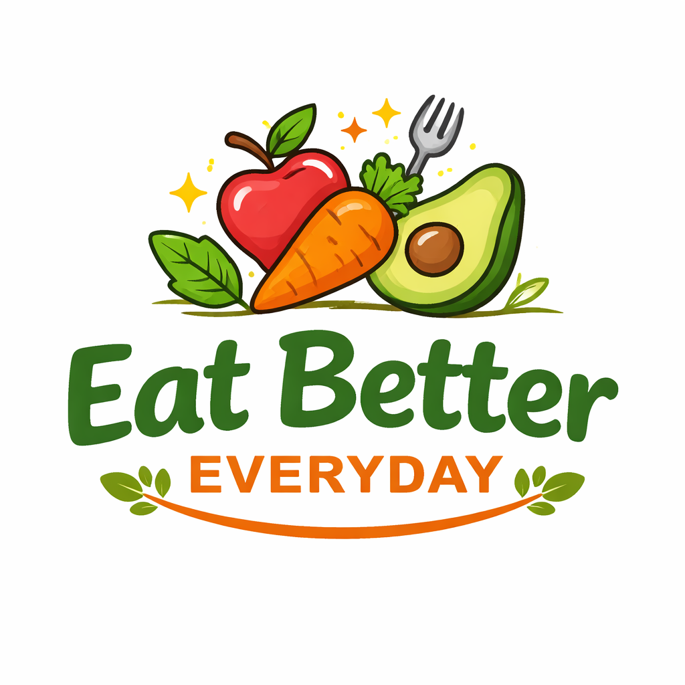

<div align="center">
  
</div>

# Eat Better Everyday Website

Welcome to the source code for **Eat Better Everyday**. This is a lightweight, responsive, static website designed for nutrition coaching services.

## 📋 Project Overview

This project is built using pure **HTML**, **CSS**, and **JavaScript**. It does not require a backend server or complex build tools, making it easy to customize and deploy.

### Key Features
* **Responsive Design:** Fully adapts to mobile, tablet, and desktop screens.
* **Interactive Elements:** Features a "Tap-to-Flip" card system for services and guides.
* **Smart Navigation:** Sticky navbar that auto-hides on scroll to maximize reading space.
* **Mobile Menu:** Custom hamburger menu for smaller devices.
* **Direct Contact:** Simple CTA buttons for Phone and Email.

## 📂 Project Structure

After cloning, your directory structure should look like this:

```text
/eat-better-everyday
├── photos/             # Folder containing all image assets
│   ├── logo.png
│   ├── eve.jpg
│   └── woman-cooking.jpg
├── index.html          # Home Page
├── about.html          # About Page
├── contact.html        # Contact Page
├── styles.css          # Global Stylesheet
├── script.js           # Navigation & Interaction Logic
└── README.md           # Documentation

```

## 🚀 Getting Started

### 1. Prerequisites

You do not need to install anything. You only need a web browser (Chrome, Safari, Firefox, etc.) and a code editor (like VS Code).

### 2. Installation

If you haven't already, clone the repository to your local machine:

```bash
git clone [https://github.com/tshakameya123/Eat-better-everyday-website.git](https://github.com/tshakameya123/Eat-better-everyday-website.git)
cd Eat-better-everyday-website

```

### 3. Running the Site

Simply double-click **`index.html`** to open the website in your browser.

**Tip for Developers:**
If using Visual Studio Code, it is recommended to use the **Live Server** extension. Right-click `index.html` and select "Open with Live Server" to see changes instantly as you edit.

## ⚠️ Important Configuration Note

**Since images are stored in the `/photos` folder, ensure your HTML and CSS paths are correct.**

If you notice images are broken (not loading), check your code references. They should point to the folder, not just the file name.

**In HTML (`index.html`, `about.html`, `contact.html`):**

* ❌ Incorrect: ``
* ✅ **Correct:** ``

**In CSS (`styles.css`):**
If you use background images in CSS, update the URL:

* ❌ Incorrect: `background-image: url('woman-cooking.jpg');`
* ✅ **Correct:** `background-image: url('photos/woman-cooking.jpg');`

## ⚙️ Customization

### Updating Contact Info

To change the phone number or email address, edit **`contact.html`**:

* **Phone:** Update the visible text AND the `href="tel:+256..."` link.
* **Email:** Update the visible text AND the `href="mailto:..."` link.

### Changing Images

1. Place your new image file inside the **`photos/`** folder.
2. Ensure the file name is **lowercase** (e.g., `profile.jpg`).
3. Update the `src` in the HTML file (e.g., ``).

## 🚢 Deployment

This site is ready for static hosting services like **Vercel**, **Netlify**, or **GitHub Pages**.

1. Push your latest changes to GitHub.
2. Connect your repository to Vercel/Netlify.
3. **Build Settings:** None required (it is a static site).
4. **Root Directory:** `./`

## 📄 License

This project is created for **Eat Better Everyday**. All code is open for modification, but image assets are personal property of the site owner.
